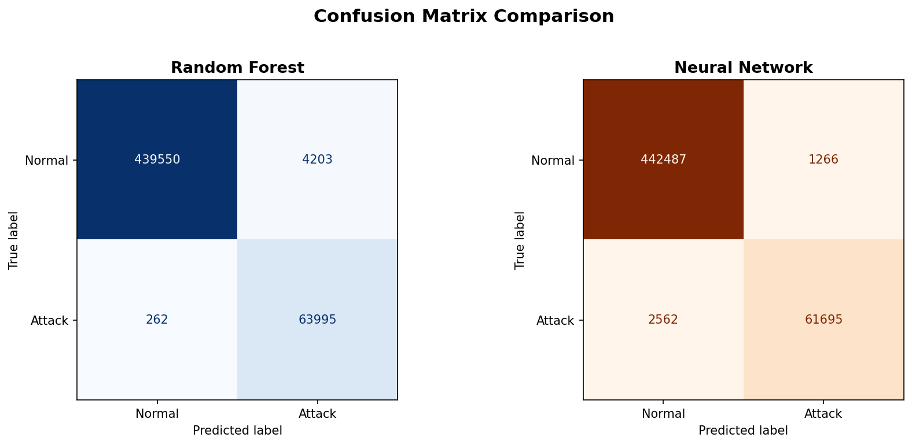
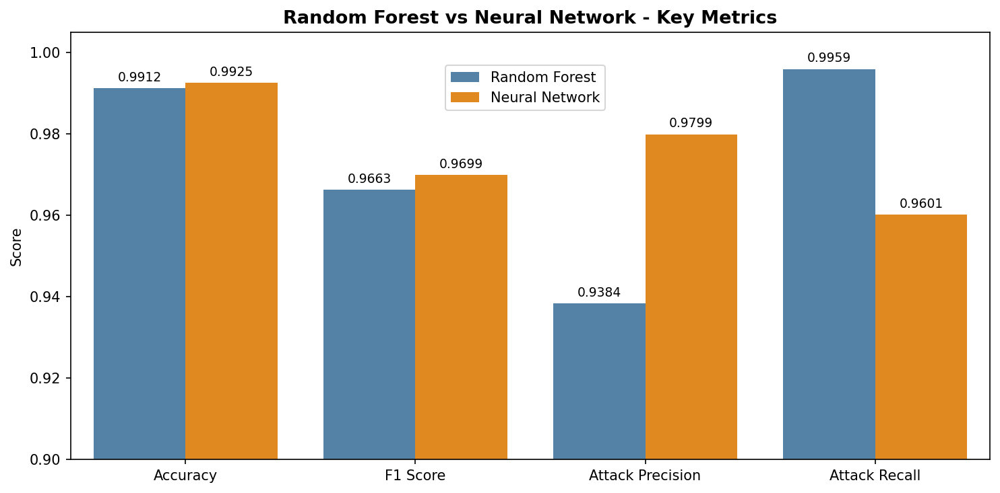
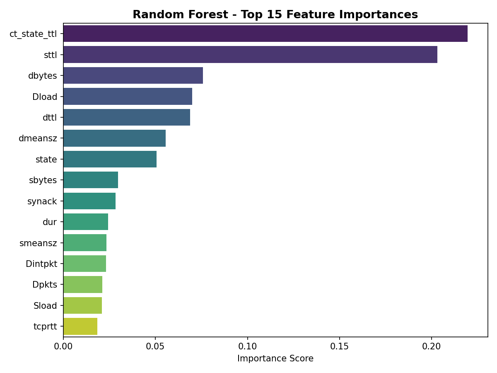

# IoT-Intrusion-Detection

# IoT Intrusion Detection System using the UNSW-NB15 Dataset

A machine learning–based intrusion detection system (IDS) for IoT network traffic, comparing a **Random Forest** classifier against a **Neural Network (MLP)** on the UNSW-NB15 benchmark dataset. The project demonstrates an end-to-end IDS workflow from raw packet-level data ingestion through preprocessing, model training, and comparative evaluation.

---

## Research Motivation

The proliferation of Internet of Things (IoT) devices has expanded the network attack surface considerably. IoT environments are characterised by:

- **Resource-constrained devices** that cannot run heavyweight security software
- **Heterogeneous traffic** mixing diverse protocols and behaviours
- **Highly imbalanced datasets** where attack traffic is a small fraction of total flows
- **Diverse attack vectors** including reconnaissance, DoS, exploits, and backdoors

This makes lightweight, accurate **anomaly detection at the network layer** a critical component of any IoT security architecture. Machine learning approaches offer a path toward IDS systems that can generalise across attack types without relying on hand-crafted signatures.

This project investigates the trade-offs between a classical ensemble method (Random Forest) and a feed-forward neural network on the UNSW-NB15 dataset, providing a foundation for future research into more advanced architectures such as **federated learning** for privacy-preserving distributed IDS, and **moving target defence** strategies for adversarial robustness.

---

## Dataset

**UNSW-NB15** — created by the Australian Centre for Cyber Security (ACCS) at UNSW Canberra. The dataset contains a hybrid of real modern normal activities and synthetic contemporary attack behaviours.

| Property | Value |
|----------|-------|
| Total records | 2,540,044 |
| Features | 49 (47 after dropping identifiers and labels) |
| Normal flows | 2,218,763 (87.4%) |
| Attack flows | 321,283 (12.6%) |
| Attack categories | 9 (Fuzzers, Analysis, Backdoors, DoS, Exploits, Generic, Reconnaissance, Shellcode, Worms) |

Source: [UNSW-NB15 Dataset](https://research.unsw.edu.au/projects/unsw-nb15-dataset)

---

## Methodology

### Preprocessing Pipeline
1. **Combine** four raw CSV files into a single dataframe
2. **Drop identifier columns** (`srcip`, `dstip`, `Stime`, `Ltime`) that don't generalise across networks
3. **Drop `attack_cat`** to prevent label leakage in binary classification
4. **Coerce mixed-type columns** (`sport`, `dsport`, `ct_ftp_cmd`) to numeric
5. **Fill nulls** in protocol-specific fields with 0 (representing "protocol not active")
6. **Label-encode** categorical features (`proto`, `state`, `service`)
7. **Stratified 80/20 train/test split** preserving the 12.6% attack ratio
8. **Standardise** features using `StandardScaler` fit only on training data

### Models

**Random Forest**
- 100 estimators, max depth 20
- `class_weight='balanced'` to address the 12.6% attack imbalance
- Trained on unscaled features (tree-based models are scale-invariant)

**Neural Network (MLP)**
- Architecture: `43 → 128 → 64 → 32 → 1`
- ReLU activations, Adam optimiser
- Early stopping on a held-out 10% validation set
- Trained on StandardScaler-normalised features

---

## Results

### Overall Performance

| Metric | Random Forest | Neural Network |
|--------|---------------|----------------|
| Accuracy | 99.12% | **99.25%** |
| F1 Score | 0.9663 | **0.9699** |
| Attack Precision | 0.9384 | **0.9799** |
| Attack Recall | **0.9959** | 0.9601 |
| Normal Precision | **0.9994** | 0.9942 |
| Normal Recall | 0.9905 | **0.9971** |

### Confusion Matrices



### Metric Comparison



### Real-World Impact (on 508,010 test samples)

| Outcome | Random Forest | Neural Network |
|---------|---------------|----------------|
| Attacks missed | 262 (0.41%) | 2,562 (3.99%) |
| False alarms | 4,203 (0.95%) | 1,266 (0.29%) |

---

## Key Findings

Both models exceed 99% accuracy, but reveal a clear and **operationally meaningful trade-off**:

- **Random Forest** achieves near-perfect attack detection (recall = 0.996), making it ideal for high-stakes environments (critical infrastructure, healthcare IoT) where a missed attack is more costly than a false alarm.
- **Neural Network** achieves higher precision (0.98), producing fewer false alarms, which is better suited to environments concerned with alert fatigue.

This trade-off motivates **ensemble or hybrid architectures** that combine the strengths of both — a natural direction for future research.

### Feature Importance (from Random Forest)



The most discriminative features are TTL-based connection state indicators (`ct_state_ttl`, `sttl`, `dttl`) and destination-side traffic volume (`dbytes`, `Dload`), consistent with prior literature on network-layer attack detection.

---

## Project Structure

```
iot-ids-unsw-nb15/
├── notebooks/
│   ├── 01_data_loading.ipynb       # Load & combine raw CSVs
│   ├── 02_preprocessing.ipynb      # Cleaning, encoding, scaling, splitting
│   ├── 03_random_forest.ipynb      # Train & evaluate Random Forest
│   ├── 04_neural_network.ipynb     # Train & evaluate MLP
│   └── 05_comparison.ipynb         # Side-by-side comparison & visuals
├── data/
│   ├── NUSW-NB15_features.csv             # Features of dataset files
|   ├── rf_confusion_matrix.png            # Random Forest confusion matrix
│   ├── rf_feature_importance.png          # Random Forest top-15 feature importances
│   ├── nn_confusion_matrix.png            # Neural Network confusion matrix
│   ├── nn_loss_curve.png                  # Neural Network training loss curve
│   ├── comparison_confusion_matrices.png  # Side-by-side confusion matrices
│   └── comparison_bar_chart.png           # Side-by-side metric comparison
├── LICENSE                                # MIT License
└── README.md                
```

---

## Reproducibility

- **Random seed**: 42 used across all stochastic operations
- **Environment**: Python 3.10+, Google Colab
- **Dependencies**: `pandas`, `numpy`, `scikit-learn`, `matplotlib`, `seaborn`, `joblib`

To reproduce:
1. Download the UNSW-NB15 CSV files from the [official source](https://research.unsw.edu.au/projects/unsw-nb15-dataset)
2. Place them in `data/`
3. Run notebooks `01` through `05` in order

---

## Future Work

- **Federated learning layer**: extend the IDS to a federated setting where multiple IoT gateways train collaboratively without sharing raw traffic, addressing the privacy concerns inherent in centralised IDS
- **Moving target defence integration**: investigate how dynamic feature subsets or model rotation can improve adversarial robustness
- **Multi-class attack categorisation**: extend from binary classification to identifying the specific attack category (`attack_cat`)
- **Real-time inference benchmark**: measure latency and throughput on resource-constrained IoT hardware
- **Ensemble model**: combine the precision of the MLP with the recall of the Random Forest

---

## Author

**Akash Kumar**
*Master of Information Technology, University of Technology Sydney*

- GitHub: [akash-kumar44 (Akash Kumar)](https://github.com/akash-kumar44)
- Email: akashbhumbak44@gmail.com

---

## References

- Moustafa, N., & Slay, J. (2015). *UNSW-NB15: A comprehensive data set for network intrusion detection systems.* Military Communications and Information Systems Conference (MilCIS), IEEE.
- Moustafa, N., & Slay, J. (2016). *The evaluation of network anomaly detection systems: Statistical analysis of the UNSW-NB15 dataset.* Information Security Journal: A Global Perspective.

---

## License

This project is released under the MIT License. See `LICENSE` for details.
